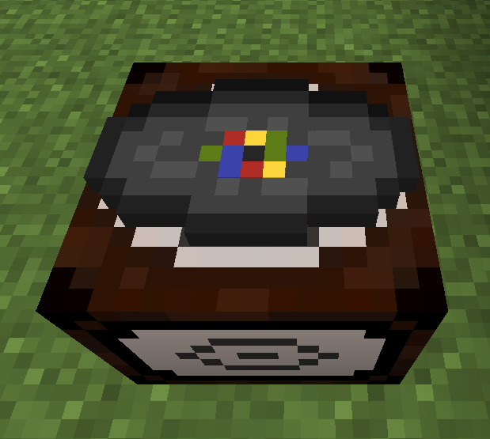
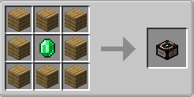
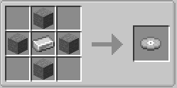
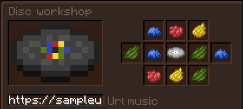

# About
Disc workshop is a 1.21.1 [fabric](https://fabricmc.net/) mod by [fozimus](https://github.com/Fozimus/).
You can craft music discs using a disc workshop, these discs can be played in the jukebox to listen to any hosted audio via URL.

This mod was inspired by [VinURL](https://github.com/Plompi/VinURL) by [Plompi](https://github.com/Plompi).

# Recipes
## Disc workshop
\
You can use any type of wood.

## Blank disc

## Music disc
\
You can use any dye to change the pattern color and insert any url to select the audio.

# Disclaimer
This mod automatically downloads [FFmpeg](https://www.ffmpeg.org/) and [yt-dlp](https://github.com/yt-dlp/yt-dlp).

This mod was created for educational and personal use only. It is provided "as is" without warranty of any kind, express or implied. The creator of this mod does not host, distribute, or provide access to any copyrighted content. This mod may allow users to download or interact with media from external sources. It is the sole responsibility of the user to ensure they have the legal right to download or use any content accessed through this mod.

By using this mod, you agree that the creator holds no liability for any misuse, copyright infringement, or legal consequences resulting from its use. Users are expected to comply with all applicable laws and terms of service of any third-party services they choose to access.

If you do not agree with these terms, do not use this mod.
